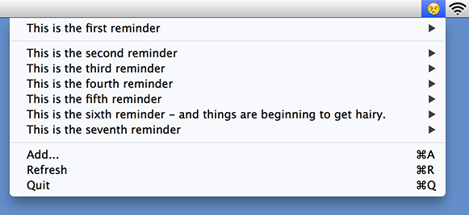
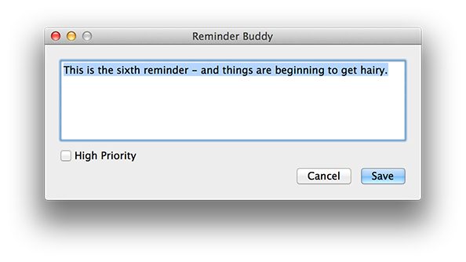

#Reminder Buddy
When I started learning Mac development late last year, I wanted to build a small tool and utility that I’d want to use. I’ve always wanted a companion app to manage my reminders from the menu bar. I discovered the EventKit API that gave me access to the same event store that Apple’s own Reminders app uses. I synchronise reminders over iCloud and that happens behind the scene without me explicitly doing anything. So the reminders I create using my app show up on my phone and vice versa.

When you start the app, it asks you for permission to access your reminders. It might also ask access to your contacts but I don’t need or use it in any way.  It seems like that simply asking for access to `EKEntityTypeReminder` reminder triggers it automatically.

The app displays reminders from your default reminder list. It's called 'Reminders' but you can make any list your default list from the Reminders > Default List menu.

Once you approve access to your Reminders, it'll show you a smiley icon on the menu bar. The smiley correspondes to the number of unfinished tasks you have in your list:

        😀: no tasks
        😠: 1-5 tasks
        😢: 6-10 tasks
        😫: 11-15 tasks
        😵: > 15 tasks

Clicking on the icon will show you your tasks. High priority tasks are shown above low priority tasks. Clicking on a task in the menu will open it in Reminders.app. You can also add a new task, edit an existing task, mark a task as completed or mark a task as high priority from within the application. All changes are saved to the Event store so they are immediately visible in Reminders.app and also on the Reminders app on iOS if you have iCloud sync enable.



## Annoyances and unfinished tasks
Adding a reminder via Reminders.app doesn't reliably trigger `EKEventStoreChangedNotification`. Saving or adding a reminder from Reminder Buddy does it somewhat more reliably but when the callback asks for a list of unfinished reminders, it gets the old list back. I guess it's cached somewhere or there is some kind of commit phase that I need to wait for. 

As a workaround:

- I've added a 'Refresh' menu that forces a query to the event store and rebuilds the menu.

- There is a NSTimer that refreshes the menu every 30 seconds


Both these options are a bit heavy-handed for my taste.


Also missing, a preferencs pane that allows you to:

1. pick a custom threshold for the icons

2. choose between showing the icon/showing a count of tasks/showing both.

As this is my first real-world Mac app and I am still pretty new to Objective C, I am quite sure there are numerous other things I could've done better. Take it for a spin, and hopefully you'll find it useful.

A pre-built binary for OS X 10.9 is included in a zip file under the bin folder.